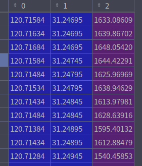
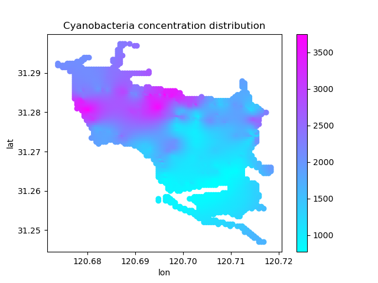

# Cyanobacteria distribution visualization

## [Source code location](main.py)

## Input

1. data_path: USV collected data
2. lake_path: lake shp file

## Usage

```shell
python main.py --data_path /media/reid/ext_disk1/blue_alage/dushu/orginial_data/20210929.csv --lake_path /media/reid/ext_disk1/dushu/dushu1.shp
```

## Output

 \
The first column is the value of lon, the second is lat and the third is the value of pc
\
\
\

plot all filtered points 


